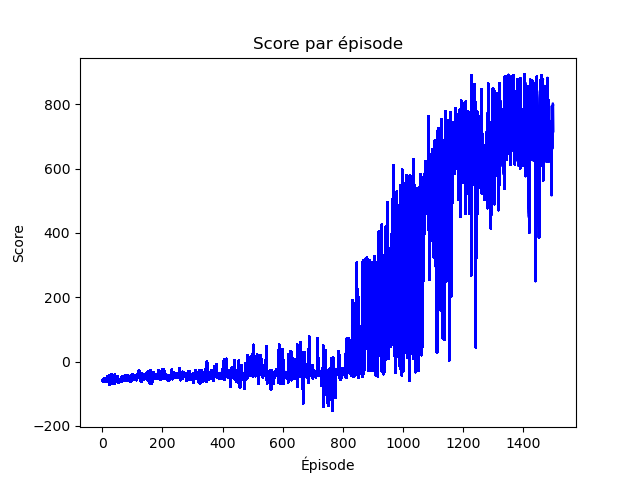
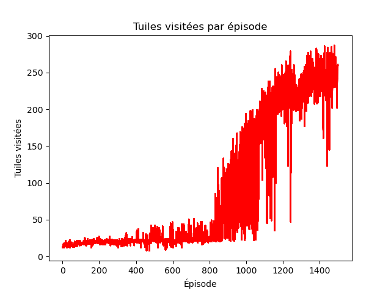

# RACING_CAR 🏎️

##  🏁 Description
Racing Car est un projet de Deep Reinforcement Learning (DRL) visant à entraîner un agent intelligent à maîtriser un environnement de conduite.

- Algorithme : Le projet utilise l'algorithme Deep Q-Network (DQN), une technique fondamentale du DRL qui combine les Q-Learning (un algorithme d'apprentissage par valeurs) avec des réseaux neuronaux profonds (Deep Learning) pour gérer des espaces d'observation vastes (images).

- Environnement : L'agent apprend à conduire dans l'environnement CarRacing-v3 de Gymnasium, qui simule une voiture vue de dessus sur un circuit généré de manière stochastique. L'agent doit apprendre à naviguer le plus rapidement possible tout en évitant de sortir de piste.

## ⭐️ Fonctionnalités et Architecture 
Cette section détaille les choix techniques et l'implémentation spécifique de l'algorithme DQN pour l'environnement CarRacing-v3.

### 🧠 Modèle d'Apprentissage  :
- **Algorithme** : Utilisation de l'algorithme Deep Q-Network (DQN) avec une architecture de réseaux de neurones convolutifs (CNN) pour le traitement des images.

- **Historique d'Observation** : L'entrée du réseau est un empilement de 4 frames successives ($84 \times 84 \times 4$), ce qui permet à l'agent de percevoir le mouvement et la vélocité (essentiel pour la conduite). 

- **Stabilisation** : Le modèle utilise un Target Network (réseau cible) pour stabiliser la prédiction des valeurs Q et une Mémoire de Replay Expérience (Experience Replay Buffer) pour briser la corrélation entre les échantillons d'entraînement.

### 🚗 Espace d'Action (Contrôles) :
L'agent contrôle la voiture via un espace d'action discret (non-continu). Il ne peut choisir qu'une seule action à la fois parmi les 5 suivantes :

1) Accélérer ("Avant")

2) Tourner à "Droite"

3) Tourner à "Gauche"

4) "Frein"

5) "Ne rien faire"

### ⚙️ Optimisation Multiplateforme :
Le code est optimisé pour une exécution accélérée sur différentes architectures matérielles avec détection automatique de la plateforme :

- Apple Silicon (Mac M1/M2/M3) : Utilisation de l'API Metal Performance Shaders (MPS) pour l'accélération GPU.

- NVIDIA (Windows/Linux) : Utilisation de l'API CUDA pour l'accélération GPU, lorsque disponible.

- CPU (Générique) : Bascule automatique sur le CPU lorsque ni MPS ni CUDA n'est détecté.

## 🛠️ Prérequis et installation

### ⚙️ Prérequis Logiciels : 
Assurez vous d'avoir : 
   - Python 3.11 (pour meilleure compatibilité avec Pytorch et Gymnasium)

### 🍎 Prérequis Spécifiques à macOS (Apple Silicon) : 
Si vous rencontrez des problèmes lors de l'installation des paquets gymnasium[box2d], vous pourriez avoir besoin d'installer des bibliothèques via Homebrew (le gestionnaire de paquets macOS) :

1. SWIG : Nécessaire pour compiler la partie Box2D de Gymnasium.

```bash
brew install swig
````

2. LTS (Library of Tensors and Streams) : Généralement nécessaire pour les dépendances de rendu graphique comme Pygame, qui est requis par gymnasium[box2d].

```bash
brew install sdl2 sdl2_image sdl2_mixer sdl2_ttf
```
### 💿 Cloner le dépôt :
   - Avec HTTPS : 
   ```bash
   git clone https://github.com/Belou25/racing_car.git
   ```
   - Avec SSH : 
   ```bash 
    git clone git@github.com:Belou25/racing_car.git
   ```

### 🐍 Installation des Dépendances Python :

Une fois les prérequis système installés (si nécessaire), vous pouvez installer toutes les bibliothèques Python :

1. Créez et activez un environnement virtuel (recommandé) :

```bash
python3.11 -m venv env
source env/bin/activate
```

2. Installez les bibliothèques à partir du fichier requirements.txt :
```bash
pip install -r requirements.txt
```

## 🕹️ Utilisation et Entraînement
### Entraîner l'Agent
Pour démarrer l'entraînement du modèle DQN : 
```bash
python DQN_agent_train.py
```

### Visualiser un Agent Entrainé : 
Pour lancer l'environnement avec la visualisation (render_mode="human") et tester un modèle pré-entraîné :

```bash 
python DQN_agent_test.py
```


## 🏛️ Structure du projet
- `save_graph/`: dossier contenant les graphiques de suivi de score et de tuile visités par la voiture pour chaque épisode.
- `weights_save/`: dossier contenant les poids du modèles entrainées (mis à jour tous les 25 épisodes).
- `weights_save/model3_weights.pth`: poids d'un modèle entrainé fonctionnel. 
- `DQN_agent_test.py`: fichier python pour visualisation du modèle entraîné.
- `DQN_agent_train.py`: fichier python pour entraînement du modèle. 
- `requirements.txt` : liste des frameworks utiles pour l'environemment. 


## 📈 Résultats 
- **Graphiques de Convergence** : 



- **Vidéo de démonstration du modèle sur 9 circuits aléatoires** :
[](https://www.youtube.com/watch?v=nw7CA66YZHk)


## 💾 Détails de l'Entraînement Initial (Poids Fournis)
Les poids du modèle pré-entraîné (`model3_weights.pth`) fournis dans ce dépôt ont été générés dans l'environnement matériel suivant :

- GPU : NVIDIA GeForce RTX 3070 (version portable)

- VRAM Dédée : 8 Go

- RAM Système : 16 Go

- Période d'Entraînement : 24 heures consécutives (environ 1500 épisodes) sur une seule session.

- Batch Size Utilisé : L'entraînement a été effectué avec un petit batch size de 32 pour rester dans la limite des 8 Go de VRAM et garantir la stabilité.


## 💡 Recommendation pour un Nouvel Entraînement 

Pour quiconque souhaite réentraîner l'agent sur une machine différente, il est essentiel d'ajuster les hyperparamètres et de surveiller l'utilisation du matériel pour maximiser l'efficacité.

1. Adapter la Taille du Batch (`Batch Size`)

La taille du batch de 32, utilisée lors de l'entraînement initial, est conservatrice. Si votre machine le permet (plus de 8 Go de VRAM), il est fortement recommandé d'augmenter le `Batch Size` pour accélérer la convergence.

2. Ajuster le Taux d'Apprentissage (`Learning Rate`)

Lorsque vous augmentez le `Batch Size`, le gradient de la fonction de perte devient plus stable et précis. Pour exploiter cette précision, vous devez augmenter le `Learning Rate` ($\alpha$) pour éviter une convergence trop lente. 

3. Surveillance de la Saturation GPU/VRAM

Pour vous assurer que vous utilisez au maximum la puissance de votre carte graphique sans dépasser la mémoire, vous devez viser une saturation du GPU/VRAM de 90% ou plus.

- Windows : Gestionnaire des tâches.
- MacOS :
```bash 
sudo powermetrics --samplers cpu_power,gpu_power -i 500
```

## 🙋‍♂️ Auteur
- Erwan GOURIOU
